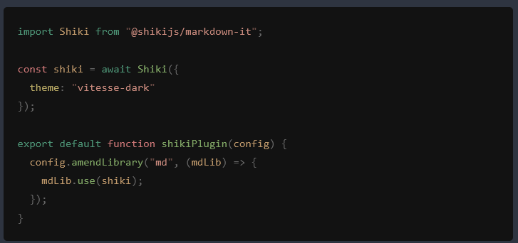
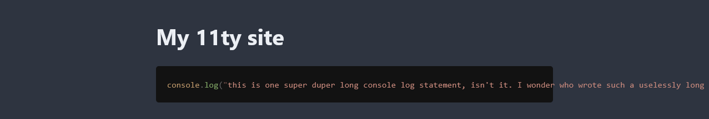

The codeblocks on this site are built using an [Eleventy](https://www.11ty.dev/) plugin to integrate the [Shiki](https://shiki.style/) syntax highlighter. Here's an example:

```js ; filename.js
console.log("hello world!");
```

There are four pieces to this setup:

1. code block syntax highlighting
2. code block styling
3. copy code button
4. filename display

## Syntax highlighting

Highlighting is added using Shiki. Specifically, I use the Shiki [markdown-it](https://github.com/markdown-it/markdown-it) plugin, which is documented [here](https://shiki.style/packages/markdown-it). Install following the instructions.

You can see the full plugin code [here](https://github.com/nathonius/11ty-site/blob/8bf422c80c185c0d41ecc5f01f97014950da6f82/build/shiki-plugin.js), but most of the plugin concerns adding the copy code button and filename display, which will be covered later. The relevant code to add syntax highlighting is very small:

```js ; shiki-plugin.js
import Shiki from "@shikijs/markdown-it";

const shiki = await Shiki({
  theme: "vitesse-dark"
});

export default function shikiPlugin(config) {
  config.amendLibrary("md", (mdLib) => {
    mdLib.use(shiki);
  });
}
```

Then we just add the plugin to the Eleventy config:

```js ; .eleventy.js
import ShikiPlugin from './shiki-plugin.js';

export default function(eleventyConfig) {
    eleventyConfig.addPlugin(ShikiPlugin);
};
```

Now, code blocks will automatically render with highlighting:

````markdown ; index.md
```js
import Shiki from "@shikijs/markdown-it";

const shiki = await Shiki({
  theme: "vitesse-dark"
});

export default function shikiPlugin(config) {
  config.amendLibrary("md", (mdLib) => {
    mdLib.use(shiki);
  });
}
```
````




> [!NOTE] Light and dark themes
> Shiki supports dual light and dark themes, they just require a little extra setup. Refer to the [Shiki docs](https://shiki.style/guide/dual-themes) on the subject.

## Code block styling

Our code block looks great! Except, oh no, we have a codeblock with one really long line of text and it's flying out of its container...



There are two strategies to fix this problem:

1. Ensure the code block can scroll when appropriate
2. Wrap long lines

Check out the css-tricks article [Styling Code In and Out of Blocks](https://css-tricks.com/styling-code-in-and-out-of-blocks/) for a more detailed look, but scrolling is really easy to implement. We just need to add a tiny bit of CSS to the `pre` block:

```css
pre {
    overflow: auto;
}
```

And then our code block should provide a horizontal scrollbar when appropriate. There's plenty of other styling we can do, but I'll just link to [my codeblock styles](https://github.com/nathonius/11ty-site/blob/8bf422c80c185c0d41ecc5f01f97014950da6f82/src/_includes/css/code.css) for now.

> [!NOTE] Adding styles
> Actually including CSS in an Eleventy site is out of the scope of this post. Check out the [Eleventy docs](https://www.11ty.dev/docs/assets/#copy-files) for details on how to add CSS to your static site.

## Copy code button

A great small but useful feature is to add a button to copy the code in a block. On my site, I've added the language to each codeblock that also functions as a copy button. There are two pieces to this:

1. A Shiki plugin transformer to add the language as a data attribute to the `pre` tag
2. A script to add the copy button on each code block

The transformer is straightforward:

```js ; shiki-plugin.js
const shiki = await Shiki({
    theme: "vitesse-dark",
    transformers: [{
        pre: function () {
            this.pre.properties.dataLang = this.options.lang;
        }
    }]
});
```

If the codeblock language was JS, this transformer would add `data-lang="js"` to the `pre` element.

Now we need the script to add the buttons:

```js
function copyCodeToClipboard(pre) {
    const code = codeblock.firstChild?.innerText ?? '';
    navigator.clipboard.writeText(code);
}

function addCopyCodeButton(pre) {
    const button = document.createElement("button");
    button.type = "button";
    button.innerText = pre.dataset.lang ?? "copy";
    button.addEventListener("click", () => copyCodeToClipboard(pre));
    pre.appendChild(button);
}

const codeblocks = document.querySelectorAll("pre");
for (const pre of codeblocks) {
    addCopyCodeButton(pre);
}
```

And some CSS to position the button:

```css
pre {
    position: relative;
}
pre > button {
    position: absolute;
    top: 0.5rem;
    right: 0.5rem;
}
```

On my site, I have some extra code to show a "copied" message along with a checkmark. You can see the full source [here](https://github.com/nathonius/11ty-site/blob/717fac483ce12dad013fe050430f7a880690bbeb/src/modules/copy-code.js).

## Filename display

Finally, we may want to show a filename along with a codeblock, which we will do within the same Shiki transformer:

```js ; shiki-plugin.js
const shiki = await Shiki({
    theme: "vitesse-dark",
    transformers: [{
        pre: function () {
            this.pre.properties.dataLang = this.options.lang;
            const filenameMeta = this.options.meta?.__raw ?? "";
            if (
                filenameMeta &&
                filenameMeta.startsWith("; ") &&
                filenameMeta.length > 2
            ) {
                const filename = filenameMeta.slice(2);
                this.pre.properties.dataFile = filename;
            }
        }
    }]
});
```

The transformer looks for a specific syntax for filenames in Markdown codeblocks, for example:

````markdown
```js ; shiki-plugin.js
const shiki = await Shiki({
    theme: "vitesse-dark",
    transformers: [{
        pre: function () {
            this.pre.properties.dataLang = this.options.lang;
            const filenameMeta = this.options.meta?.__raw ?? "";
```
````

> [!NOTE] A warning
> This method of adding the filename is definitely NOT stable. Accessing the `__raw` property isn't officially supported and may break in the future. Similarly, adding the filename to the language specifier is not standard Markdown and could easily break or conflict with parsers. Use at your own risk.

Now, we can add the filename to `pre` blocks using only some CSS:

```css
pre[data-file]::before {
    content: attr(data-file);
    display: block;
}
```

And now a before pseudo-element will be prepended to the codeblock with the filename.
