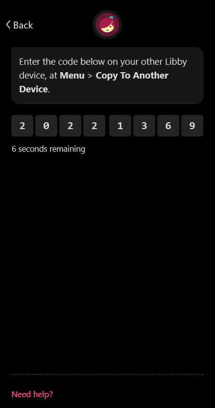
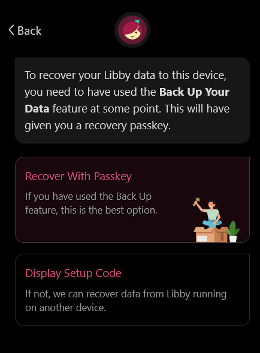
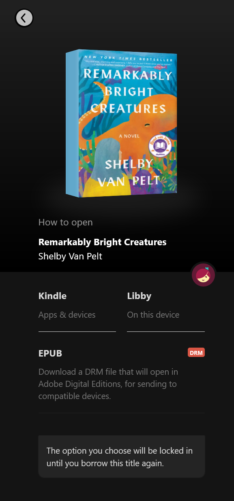

[Libby] is a fantastic resource for ebooks, assuming your local library participates in the program. You place holds and check out books like a physical library, but you receive digital books instead. Just like the library you can't keep the books; once your loan ends the digital book will disappear unless we remove the DRM. This guide shows how to download books with Libby and remove the DRM with [Calibre].

## Prerequisites

### Libby login

You'll need access to [Libby] through your library; Libby setup is out of the scope of this guide. If you're logged into Libby on a mobile device, it may be easier to get the books onto your computer by logging in on your computer. This is optional; if you prefer to download the files to your phone then transfer the file to your computer that will work as well. To log in on desktop:

1. Navigate to [Libby] in your web browser of choice
2. Select "Yes, I Have A Library Card" and "Recover Your Data"
3. Select "Display Setup Code"

You should get a code that is valid for 60 seconds, which will rotate to a new code when time expires. On your phone, navigate to the Menu tab and scroll down until you find an option labeled "Copy To Another Device".

Once able, input the setup code on your phone, and your desktop browser will be logged in.

### Calibre and DeDRM install

Download and install the latest version of Calibre for your operating system from the [downloads page](https://calibre-ebook.com/download). Once installed, run Calibre. Assuming it starts up correctly, we must install a plugin to remove DRM from ebooks.

Download the [DeDRM](https://github.com/noDRM/DeDRM_tools/releases/latest) plugin from GitHub. Select the zip file in the Assets section. Extract the zip file, which contains two other zip files: `DeDRM_plugin.zip` and `Obok_plugin.zip`; the first is for removing Kindle DRM, while the second is for Kobo DRM. Install one or both depending on your needs by navigating in Calibre to Preferences > Plugins, and select 'Load plugin from file'. Select the plugin zip file.

Once installed (you may need to restart Calibre), DeDRM automatically removes DRM from books imported into Calibre. No further setup is needed for importing books from Libby.

## Downloading books in the right format

Once logged into Libby, you need to select the proper option to download a book. By default, Libby may attempt to open the book directly in the Kindle app or in its own reader. Instead, you must select the "Read with..." option, possibly select "Other Options..." and select the EPUB option:

This will either download an EPUB with no DRM or an Adobe Digital Editions `.acsm` file. If you have an EPUB file, you only need to click and drag it into Calibre and you're done.

### Downloading an EPUB from Digital Editions

An `.acsm` file requires you to install [Adobe Digital Editions](https://www.adobe.com/solutions/ebook/digital-editions/download.html). Download and install the application for your operating system. Once installed, double click the `.acsm` file and Digital Editions will download the book and open it in its reader. Behind the scenes, this has downloaded an EPUB with DRM.

Now, locate your "My Digital Editions" folder. This will be in "My Documents" on Windows. Inside, you'll find the EPUB file you just downloaded. Drag the file into Calibre.

## Now what?

Calibre is a very powerful but sometimes inscrutable piece of software. From here, you can add more metadata to books like series info, covers, etc.

> [!NOTE] Adding series info
> The easiest way is to click into the series cell for a book from the main page, type the name of the series, then the number of the book in square brackets. For example, `Lightbringer [2]` would mark the book as the second in the Lightbringer series. You can also right click on a book, and edit all of its metadata, including series.

Calibre supports copying to/from most e-reader devices, including Kindle and Kobo. Just plug your device in and select "Send to device" on the books you want. If not available for your device out of the box, you may need another plugin.

[Libby]: https://libbyapp.com/
[Calibre]: https://calibre-ebook.com/