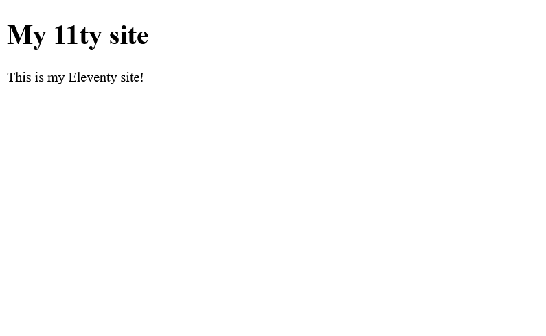
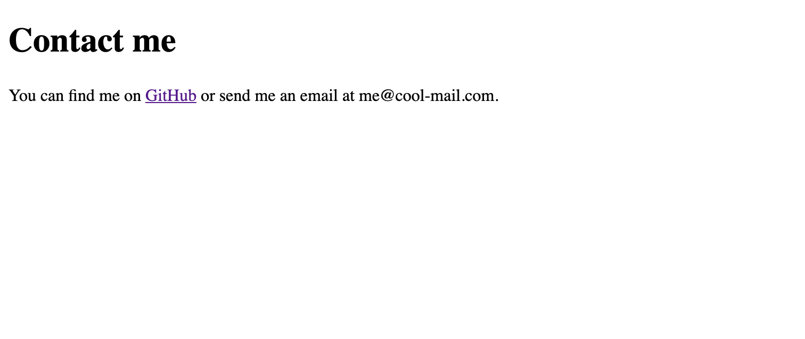
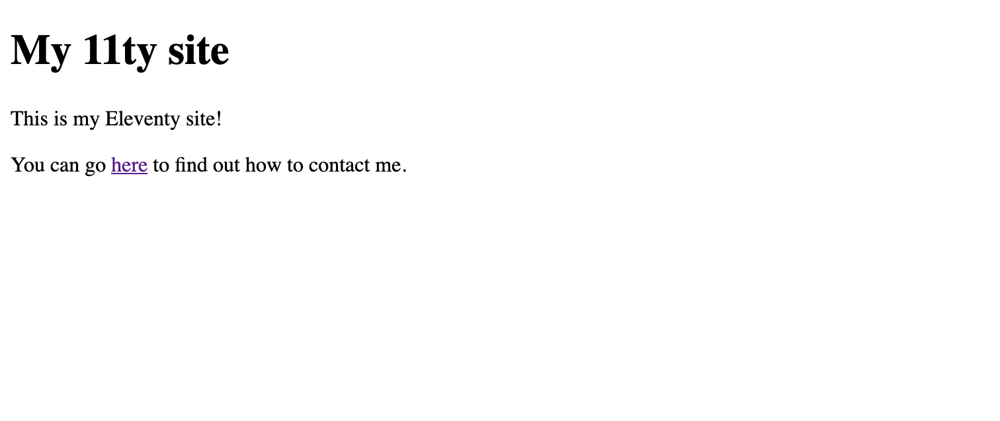

This is part one of a series on publishing a website from an [Obsidian](https://obsidian.md/) vault using the [Obsidian Git plugin](https://github.com/Vinzent03/obsidian-git), [Eleventy](https://www.11ty.dev/), and GitHub Actions. This part explores setting up Eleventy and creating the basis of a static site, with or without Obsidian.

Other parts in the series:

{{ post.data.series_number }}. [{{ post.data.title }}](post.page.url)

## What is Eleventy?

Eleventy (often stylized as 11ty) is a highly-configurable, non-opinionated static site generator. They bill themselves as a "simpler" static site generator, but I don't know if I really agree with that; it lets you build a site your way, simple or not.

This post will cover how I chose to set up my site with Eleventy, but there's a bunch of other ways you could do it! If you hear nothing else, the biggest take-away should be to start small. Add a single page, then two, and only add features and configurations as you need them. Doing so will keep the process from being overwhelming and give you [the wonderful feeling of being done](https://www.youtube.com/watch?v=bJQj1uKtnus), even if the site isn't perfect.

I'll be frequently referring to the [Eleventy docs](https://www.11ty.dev/docs/) (and so should you), but the docs make very few recommendations on actually building a complete product. Instead, they give you all the tools and parts you need, to build something of your own.

### What Eleventy isn't

Eleventy is not a low or no-code solution for the web and it requires some level of knowledge of Node.js, JSON, and the basic concepts of a templating language. If that doesn't describe you, Eleventy might not be the tool for you - and that's okay! WordPress is still great. Heck, even Blogger and tumblr are still viable options.

Eleventy also doesn't come with any themes, frameworks, or other tools to make a website look *good*. It's only concerned with the actual construction of the site. There are a number of [Starter Projects](https://www.11ty.dev/docs/starter/) available to kick off your site, but I recommend learning the basics yourself first.

## Follow along

The site we're building is a real website you can run! You can see the code at each major checkpoint in the process at my 11ty-demo GitHub repo.
## Setup

> [!NOTE]
> The final version of the site for this section can be viewed [here](https://github.com/nathonius/11ty-demo/tree/main/1-setup).

### Prerequisites

I'm assuming Node.js is already installed, as setting that up is outside of the scope of this post. The initial setup steps are going to be basically the same no matter how you choose to build your site, so I recommend following the steps in the official [Get Started section](https://www.11ty.dev/docs/) of the Eleventy docs at least until you can serve your site locally. I'll summarize those steps here:

```shell
# create the project directory
mkdir my-project
cd my-project

# git setup
git init
echo 'node_modules/\npublic/' > .gitignore

# initialize the nodejs project
npm init -y
npm install --save-dev @11ty/eleventy@canary

# create the eleventy config file
touch .eleventy.js

# add an index template
mkdir src
echo '# My Project' > src/index.md
```

> [!NOTE]
> Using the canary tag will install the latest Eleventy 3.0.0 alpha version. Keep in mind that this version, while largely stable, could experience breaking changes. However, I believe that the amount of improvements in v3 make the risks worth it. When Eleventy v3 is released to the stable branch, you should instead run `npm install --save-dev @11ty/eleventy@latest`.

### Folder structure

To begin with, lets set the source and output directories for our site. By default all source files beginning in the current directory are included, and `_site` is used as the output directory. I prefer `src` and `public`, so let's set those in `.eleventy.js`:

```js ; .eleventy.js
export default function (config) {
  return {
    dir: {
      input: "src",
      output: "public",
    },
  };
}
```

We'll be using ES module syntax in this project so we also need to set `"type": "module"` in our `package.json` file. I'll also add a couple scripts to build and serve our project. The final `package.json` will look like this:

```json ; package.json
{
  "name": "my-project",
  "version": "1.0.0",
  "description": "",
  "main": "index.js",
  "type": "module",
  "scripts": {
    "build": "eleventy",
    "serve": "eleventy --serve"
  },
  "keywords": [],
  "author": "",
  "license": "ISC",
  "devDependencies": {
    "@11ty/eleventy": "^2.0.1"
  }
}
```

### Test

And that's all we need to build our site! You can run the Eleventy development server using the `--serve` flag, which I've added as the npm `serve` script:

```shell
> npm run serve

> my-project@1.0.0 serve
> eleventy --serve

[11ty] Writing ./public/index.html from ./src/index.md (liquid)
[11ty] Wrote 1 file in 0.09 seconds (v3.0.0-alpha.17)
[11ty] Watching…
[11ty] Server at http://localhost:8080/
```

Open up your browser to see the `index.md`, which has been compiled to `index.html` in the public directory. If all went well you should see a large heading that says "My Project". Eleventy will automatically reload the browser when any known source file changes. Give it a try, and change the content of the `index.md` file.

## Layouts

> [!NOTE]
> The final version of the site for this section can be viewed [here](https://github.com/nathonius/11ty-demo/tree/main/2-layouts).

Now that we have a functioning static site, we need to do a little prep-work before providing content. The built `index.html` file only includes the content we gave it; we need to create a valid HTML5 page instead.

```shell
> cat public/index.html
<h1>My Project</h1>
```

Markdown supports HTML tags, but we don't want to repeat all of our HTML boilerplate for each page. Instead, we will use a layout.

First, we need to create the `_includes` directory, a special directory of template files that Eleventy can pull from to build our site, and a base [Nunjucks template](https://mozilla.github.io/nunjucks/) to use:

```shell
mkdir src/_includes
touch src/_includes/base.liquid
```

In `base.njk`, we add the following boilerplate:


```html ; base.njk
<!DOCTYPE html>
<html lang="en">
  <head>
    <meta charset="UTF-8" />
    <meta name="viewport" content="width=device-width, initial-scale=1.0" />
    <title>My Project - {{ title }}</title>
  </head>
  <body>
    <h1>{{ title }}</h1>
    <main>
      {{ content }}
    </main>
  </body>
</html>
```



Notice the three Nunjucks template variables; `<title>My Projecct - {{ title }}</title>` will set the page title from metadata we provide in content files, while `{{ content }}` will be replaced with the content from our markdown files. We also add a page header using the title.


> [!NOTE]
> The `safe` filter tells Eleventy (and Nunjucks) that the content we're passing it should NOT be sanitized, and instead be rendered as HTML as is. Never, ever pass any untrusted input with the `safe` filter.

Now Eleventy knows about our base HTML layout, but we need to also set it in our index file. Update `index.md` with the following content:

```markdown ; index.md
---
title: My 11ty site
layout: base.njk
---

This is my Eleventy site!
```

The content between those three dashes is our YAML frontmatter. Eleventy makes this metadata available to the templating engine so we can replace references to it in the output. These values are also available to the layout. Now if we check our built site, we can see that the page has been updated with the new content.



Later on, we'll make more layouts, but for now we can stick with just the one.

### A word on templating engines

Eleventy supports a bunch of templating engines out of the box, but the default is [Liquid](https://shopify.github.io/liquid/). We used Nunjucks for our layouts, so it might be a good idea to set the default templating engine for our markdown files to Nunjucks as well to be consistent. If you prefer Liquid's syntax, that's totally fine! We can configure the default in `.eleventy.js`:

```js ; .eleventy.js
export default function (config) {
  return {
    markdownTemplateEngine: "njk",
    htmlTemplateEngine: "njk",
    dir: {
      input: "src",
      output: "public",
    },
  };
}
```

Now we can use the exact same syntax in both our `.njk` layout files as well as markdown and html content files.

## Linking to other pages

Now that we have the basis of a static site and need some content. This is probably the hardest part of making your own personal website, and the part that will take the most time. For now, we will focus on how to add more pages and how to link between them.

> [!NOTE]
> The final version of the site for this section can be viewed [here](https://github.com/nathonius/11ty-demo/tree/main/3-linking).

### Creating new pages

Adding new pages just means creating new template files. For this exercise, we'll add a contact page that we can get to from the index.

```shell
touch src/contact.md
```

We'll add some simple content:

```markdown ; contact.md
---
title: Contact me
layout: base.njk
---

You can find me on [GitHub](https://github.com/nathonius) or send me an email at me@cool-mail.com.
```

Serve the site and navigate to `localhost:8080/contact`, where you should see our `contact.md` markdown file compiled to good ole HTML.


### Linking between pages

We can't expect visitors to navigate directly to the contact page. We could use an absolute link, like `[contact](/contact)`, but using an absolute path means our link probably won't work inside the application we're using to author the content (like Obsidian). Additionally, we might later have nested paths or more complicated setups where the name of the html output doesn't necessarily match the name of the source file, we need a better way. Using an absolute path also won't always work Thankfully, Eleventy has us covered. We just need to add a plugin:

```js ; .eleventy.js
import { InputPathToUrlTransformPlugin } from "@11ty/eleventy";

export default function (config) {
  config.addPlugin(InputPathToUrlTransformPlugin);
  return {
    markdownTemplateEngine: "njk",
    htmlTemplateEngine: "njk",
    dir: {
      input: "src",
      output: "public",
    },
  };
}
```

The `InputPathToUrlTransformPlugin` does what it says on the tin - transforms input paths to urls.

Now if we want to link to our contact page we can link directly to the markdown file:

```markdown ; index.md
---
title: My 11ty site
layout: base.njk
---

This is my Eleventy site!

You can go [here](./contact.md) to find out how to contact me.
```



And, importantly, this link will work in a markdown editing application as well, so we can test drive our links before publishing. Neat!

## Wrap-up

With that completed, we're set up to add more content and link freely between pages. There's still plenty to do before the website is finished, but this is a great start. Next time we'll look at styling our site.