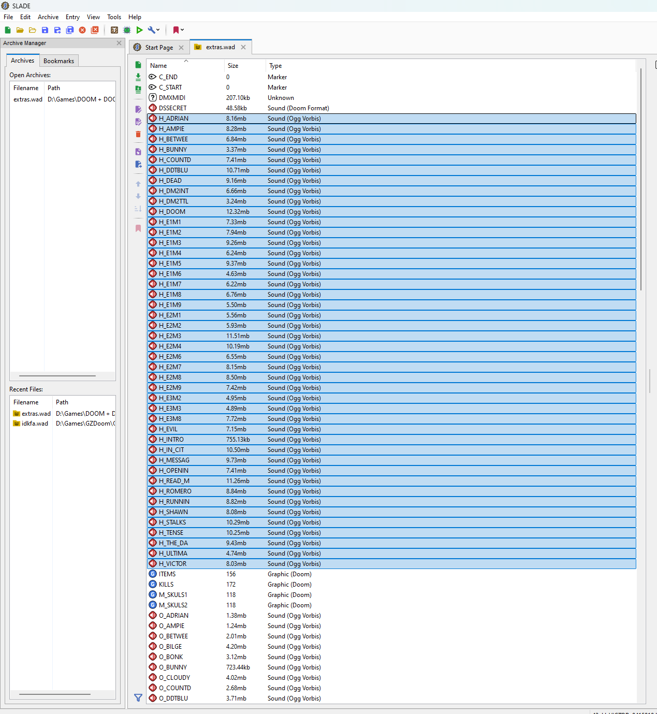

id Software and Nightdive Studios recently put out a [new version of Doom and Doom 2](https://store.steampowered.com/app/2280/DOOM__DOOM_II/), and it's great! It was a free upgrade for anyone who already owned Doom, it includes a ton of new content, supports multiplayer, and more. No complaints here! The best addition is the official inclusion of Andrew Hulshult's (whose name you should recognize as the composer for the [DUSK soundtrack](https://open.spotify.com/album/76UOCrbziU5D43w6u0470o?si=CcN9lO0BQ-66OPJA38sH2g)) version of the Doom OST, [IDKFA](https://open.spotify.com/album/2YqpDPPwqaKCoSBe36hVAe?si=kyHcpXo_RfeHUmC1_HKOow).

The new version runs on Nightdive's KEX engine, which is a perfectly fine way to play Doom... but it's not the *best* way to play Doom. I believe that honor goes to [GZDoom](https://zdoom.org/downloads), and thankfully the WAD files from this new release are perfectly compatible. Except the soundtrack. However, it's pretty simple to get the music into the right format for every other Doom source port.

## Prerequisites

You'll need the new Doom + Doom 2 release, which you can get from Steam, GOG, or any other platform you like. Then download and install [SLADE](https://slade.mancubus.net/index.php?page=downloads), an editor for Doom WAD files.

## Extract files

1. In SLADE, open the `extras.wad` file from the new Doom + Doom 2 release
	- You don't need to select a base WAD for this, just pick the extras wad
2. Sort the contents of the wad by name or type, and select all of the sound files whose names begin with `H_`; there should be 44 of them
3. Right click and select export. Make a new folder to store the .ogg files and select it.
\

## Rename

Next, we need to rename all of the files. You can do this one at a time or quickly with a command line tool or with PowerRename from [Microsoft PowerToys](https://github.com/microsoft/PowerToys). However you do it, rename all the files so that they are `O_<name>.ogg` instead of `H_<name>.ogg`.

## Create a new WAD

Finally, in SLADE, create a new "Doom WAD Archive", and click and drag your renamed files from Explorer into SLADE. Save the resulting archive as `idkfa.wad` or whatever you like, and load it with GZDoom. Viola, new music.

For more info on how to load multiple WAD files with GZDoom, just google GZDoom tutorial. I personally use the [AceCorp Launcher](https://accensi.gitlab.io/acecorpengineering/acecorp-launcher.html) to manage multiple WAD files, but it's entirely up to you to Doom how you please.